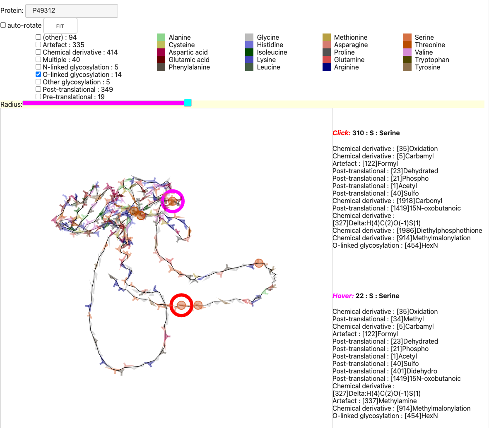
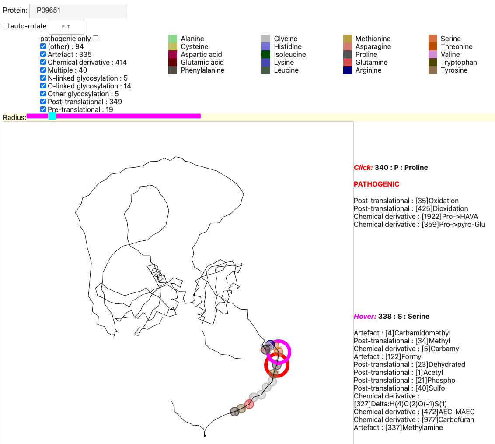

# ANNOTED -- bioviz2022

ANNOTED :: Bioviz 2022 visualization challenge entry.

This repository implements ANNOTED -- an interactive visualization
intended to address the requirements of the
<a href="http://biovis.net/2022/biovisChallenges_vis/">
Bio+MedVis Challenge @ IEEE VIS 2022: Taming protein beasts through visualization 
(http://biovis.net/2022/biovisChallenges_vis/).
</a>

<a href="https://aaronwatters.github.io/bioviz2022/challenge.html">
Go to the challenge entry web page interface.
</a>

# Screen shots

Below the interface displays
O-linked glycosylation annotations for protein P94312.
By rotating the figure and hovering over the selected annotations
we can see that all such annotations are Serine residues on one side
of the exterior of the protein.

Below the interface displays annotations near a residue where mutations
are known to be associated with disease.

# Credits

The code was implemented by
<a href="https://www.simonsfoundation.org/people/aaron-watters-ph-d/">
Aaron Watters</a>. 
<a href="https://www.simonsfoundation.org/people/vikram-k-mulligan/">
Vikram Mulligan provided scientific insight, explanations, and suggestions.</a>

# Notes

Amino acid residue colors were borrowed from
<a href="http://acces.ens-lyon.fr/biotic/rastop/help/colour.htm">
http://acces.ens-lyon.fr/biotic/rastop/help/colour.htm</a> and modified
for better visibility.

Amino acid abbreviations were taken from
<a href="https://i-base.info/ttfa/hiv-and-drug-resistance/appendix-3-list-of-amino-acids-and-their-abbreviations/">
https://i-base.info/ttfa/hiv-and-drug-resistance/appendix-3-list-of-amino-acids-and-their-abbreviations/</a>.

